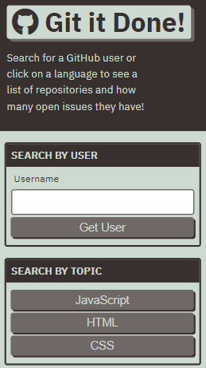
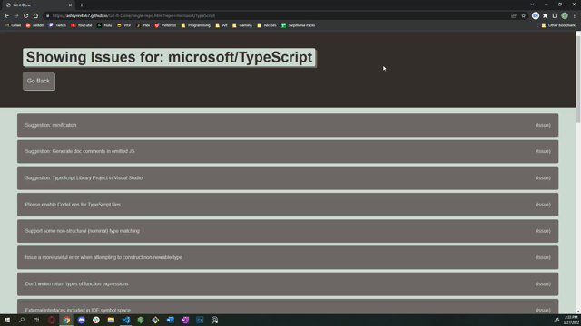

# Git-It-Done

### Introducing live updates!

Have you ever wanted an easy way to browse GitHub by language or by username to find issues which need resolved? Now you can! Our app brings you an intuitive interface that allows you to browse repository issues by language or by repository owner. When you click on the dynamically generated elements, they bring you to the GitHub page where you can view the issue on Github. This allows you to easily find ways to contribute to the open-source coding community.

This application was my first experience with using JavaScript to access the server side of webpages. I was able to use the GitHub API documentation to implement their technology into my site, allowing for a seamless transition between the two resources. I learned how to request data, as well as how to write code to catch any errors that fall through the cracks.

## Usage and Features

This is how the main page appears to users. The page is responsive, adapting to multiple screen sizes.

The main page appears relatively empty when you first load into it. However, typing a username into the search bar on the right and clicking "Get User" will then display your search results for repositories belonging to that user. Each repository will list how many issues it currently has open, if any. You can also utilize the search by language feature. Simply press the button of the language you wish to search, and the popular results for that language will appear.

Once clicking on the repository name, a new page opens that lists all issues within that repository. If you click on these dynamically generated elements, they will link you to the github issue page in a separate window. If you ever want to return to the main page, you simply have to click the "Go Back" button in the top left.

## Deployed Site

Need to search GitHub Repos? Look no further. <a href="https://ashlynn4567.github.io/Git-It-Done/">Click here to access the site!<a>

## Suggestion Box

In the future, I would like to add the following improvements:

- The ability for users to select the options by which they want to sort their results. For example, a button that the user could click to sort alphabetically or by most popular.
- I would like to add the ability to save the search results to the homepage if the user clicks the back button. However, refreshing the page would refresh the results.

I'm a big believer in always refactoring code to improve it's functionality. If you would like to suggest your own improvements, you can reach me at the following links.

- <a href="mailto:ashlynn4567@gmail.com">Email<a>
- <a href="https://github.com/ashlynn4567">GitHub<a>
- <a href="https://www.linkedin.com/in/ashley-lynn-smith/">LinkedIn<a>

## Credits

This project was built with <a href="https://static.fullstack-bootcamp.com/module-6/module-6-starter.zip">this</a> starter code from the University of Oregon's Coding Boot Camp.
